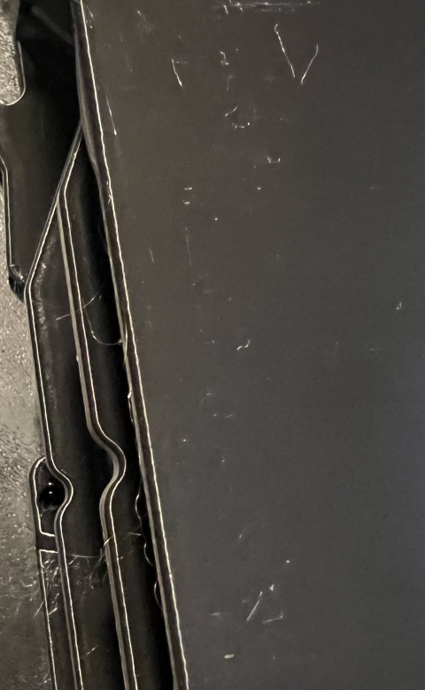
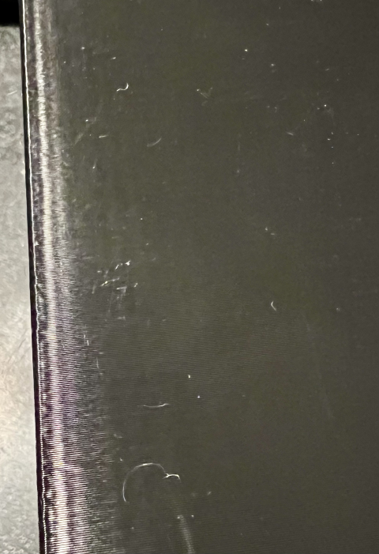

# Bambu X1 Carbon & AMS, One Year In
## Introduction
It has been just over a year since my X1 Carbon and AMS arrived. It was certainly a nice addition to my existing stable of printers. It has proved a useful and reliable printer. And while this may not be quite so important, it is a pleasant piece of equipment to work with. Nonetheless, there have been a number of issues with it most of which I have been able to effectively address.    
  
The purpose of this document is to cover what the X1 Carbon "X1" does well, its shortcomings, and what I have done to address its shortcomings. As no 3D printer is of much use without a slicer I will also spend a bit of time on Bambu's slicer Bambu Studio, a fork of PrusaSlicer.  
  
As a reference printer for comparison I will use my Prusa Mk4S (an MK4 upgraded to a MK4S), a contemporary printer albeit a bed slinger.    
  
## First Impressions  
The X1 arrived in a single sturdy box.  
Setting up the X1 consisted of:  
 - unboxing the printer and AMS  
 - connecting the required bits - a PTFE tube, a data cable, a power cord  
 - installing Bambu Studio  
 - powering on the X1  
 - connecting Bambu Studio wirelessly to the X1  
 - loading several spools into the AMS - provided with the X1  
This took me ~15 minutes after which I was ready to print.  
### First Print  
Benchy, you're up, in sickly green Bambu PLA.  
Slice then "Print Plate", Send to printer (never even looked at the instructions, a good sign)  
After 6 or 7 minutes of the X1 bed leveling and such, a nice first layer was printed with many more to follow.   
Another 31 or so minutes I had a nicely printed Benchy. The overall print quality was quite good. The only fault to be found was a common one; the "waterline" transition was obvious - it shouldn't be. In fairness, most 3D printers struggle with the waterline (my MK4S doesn't). And the print took 31 minutes, 38 minutes including the heating and bed leveling operations.
For a Benchy that is an excellent time, especially for one printed well (footnote 1)  
I then printed Benchy using black PETG and it printed every bit as well including a nice finish and zero stringing.  
#### Definitely a success!  
    
 ## AMS - MultiColor Printing Made Easy  
 The X1 can accept filament from a single spool or from an AMS which can provide up to four spools. For the adventurous one can attach up to four AMS to a single X1; I have two attached to mine. The spools can be mixed by color and type. The only constraint is if a spool runs out during a print the AMS will only fail over and continue to another spool of the same type and color.  
   
 #### Actually an overall ease of use improvement  
 An AMS -or multiple- provides a very noticeable ease of use improvement, and one which is not limited to multi color prints.
 I typically have my AMS loaded with PETG, two spools of black, one of gray, and one of white. These three colors account for a 80% of what I print. I can freely switch between these colors, either for a single print or for a series of prints and the only time I need to manually change a spool is when one runs out. And if I am printing a LOT of single color I simply load the AMS with four spools of that color (and of course same type) then I can print up to 4 kg of models without manually loading or unloading a spool.   
   
 I can't emphasize the convenience of this enough. While speed and other factors have helped, this one convenience is [arguably] by itself responsible for doubling the amount of printing I do.   
   
 When one considers its very reasonable price along with how easy it is to set up and use, the AMS is a remarkable. 
Simply put, __don't buy an X1 or P1 without an AMS ... or two or three or four__  
  
## AMS - it's not all roses  
Using an AMS does present a few issues, although all but one of issues are reasonably addressable.  
#### Waste  
Printing multicolor models with an AMS results in a significant amount of wasted filament due to the process used to change filaments. In many cases, some care with setup can reduce the amount of wasted filament. However, printing non-simple (say figurines) models with multiple colors can result in the amount of filament being wasted (by color changes) exceeding the amount of filament in the resultant model, at times significantly.  
##### A comparison  
Prusa's MMU3 on the MK3S+ and MK4 supports multiple filaments for multicolor printing (up to five different filaments) and generate very little wasted filaments, even for very colorful models. Early versions of the MMU were difficult and tedious to install and to operate. The MMU3 is great improvement over earlier versions simplify installation and usage along with improving reliabilty. Nonetheless, while it wastes very little filament, installing and using an MMU3 still requires significantly more effort than installing using an AMS or even four of them.   
### Filaments and the AMS  
#### Bambu Filaments  
Bambu's first product, the X1 (not the X1 Carbon), was launched on Kickstarter. It was a tremendously successful launch to the tune of more than 7 Million USD. A clear part of their business strategy was to provide -sell- filaments specifically formulated for their printer(s). By using Bambu filaments in Bambu printers customers could avoid most if not all of the filament-specific guesswork and tuning required to get the best results for any given filament ... and it gave, rather gives, Bambu a nice forward revenue stream.  
  
If one has an AMS there's an additional benefit to using Bambu Filaments. When adding a spool to an AMS one must set the filament type and the color for the spool. In the case of Bambu filaments each spool has an RFID tag which identifies the filament type and color. So, when a Bambu filament spool is added to an AMS the AMS will automatically read the spool's RFID then automatically configure itself appropriately. Convenenient.  
  
I have only used Bambu PLA and Bambu PETG. Frankly, I have been unimpressed. It performed okay, but not wonderfully. I have found it (based on resultant print quality) a noticeable step down from the likes of Voxel PLA (their PLA and PETG), Filamentum, Polymaker, SunLu, eSun, Hatchbox, my current go-to Elegoo Rapid (PLA+ and PETG) and a big step down from Prusamente. With the exception of Prusamente, Bambu is more expensive, typically quite significantly more, than the ones I listed which print noticeably better.    
##### an exception, maybe?  
I have ordered a spool of their AMS-compatible TPU, primarily out of curiosity. TPU has historically simply not worked in an AMS. The Bambu AMS TPU is a new release and my order has yet to arrive. We shall see.  
  
#### Non-Bambu Brand Filaments  
The X1 will print well with most decent brands of either PLA or PETG. And most will work also work well in an AMS. 
Bambu Studio ships with profiles with a fairly broad ranges of "Generic" filament profiles/presets. Starting with an appropriate Generic profile/preset then using Bambu Studio's built-in calibration utilities one can quickly and easily create printing profiles/presets for most any brand and type of filament (assuming material type is supported: PLA, PETG, ABS, ASA, PC). One can then use the new profiles as created or dive in and edit quite the range of configuration settings for handling the filament.   
  
When using a non-Bambu filament one will have to manually select the correct filament profile/preset to use in Bambu Studio by picking from a drop down which includes the profiles/presets provided by Bambu along with any custom ones the user has created.  
  
There is some clunkiness to managing the list which I'll touch on later. However, its typically very simple; Pick one from the drop down.  
  
***And now, the last two AMS items.  ***  
 #### A tight fit  
 1 kilogram spools of print filament come in a range of diameters and widths.   
   
  
#### lastly, WTF?  
Ensuring filament is dry when it is use is important, especially with any filament material other than PLA. It's important with PLA, but PLA is much less hygroscopic than most other materials so absorbs moisture far more slowly.  
  
To help with this the AMS lid seals well to help keep moisture out of the AMS and includes two installed desiccant packs to absorb any moisture within the AMS.  
  
Regarding the included and installed desiccant packs the manual says the following:  
<blockquote>
**Note: Please check the status of the desiccant every two weeks, if the desiccant has failed, please replace it in time. If the desiccant is not replaced for a long time, it will lose its ability to absorb water, thus losing its ability to protect the dried filament. In addition, when it is not replaced for more than 3 months, the desiccant may also leak water, short-circuit, or damage the circuit or electronic components inside the AMS.**  
</blockquote>
  
The politest comment I can come up with -by far- is, **What the Hell were they thinking?**  
Get rid of the desiccant packs from Hell ASAP! Then print and use one of the numerous desiccant container models designed to use with the AMS.  
##### AMS Specific Desiccant Containers   
[These ](https://www.printables.com/model/299215-bambulab-ams-dryer-pod-with-indent-for-ams-fix) work quite well.
And if you have a Hydra Pro modification, try [these](https://www.printables.com/model/706509-bambulab-ams-hydra-pro-silicadesiccant-dry-boxes).  
I've made a few tools to make the second one easier to fill, a funnel that snaps on and a premeasured cup/scoop [here](https://www.printables.com/model/893342-funnel-for-ams-hydra-desiccant-boxes)  
  
A quick comment on desiccants, don't buy the blue (pink when saturated) desiccants. Instead, get the orange (green when saturated) instead. The blue desiccant uses cobalt chloride as its moistures indicator, Blue >>> Pink. Cobalt chloride easily leaches from the desiccant, is toxic, and carcinogenic.  [wikipedia - cobalt chloride(II)](https://en.wikipedia.org/wiki/Cobalt%28II%29_chloride)  
  
I'd recommend if you buy desiccant in bulk, make sure you're getting beads with a minimum size of 2 mm, 3 mm if reasonable.  
  
## Specs - umm, sorta.  
  
### Lies, Damned Lies, and Maximum Build Dimensions  
The specification lists 256 × 256 × 256 mm.  
256mm on the z-access is correct.  
The build plate itself is 256 x 256 mm, but not all of it is available for printing. And, for multicolor printing, even less.  
  
### Print Speeds, 
significantly flow rate limited well under spec  
layer adhesion limited well under spec  
  
## Print quality  
Print quality with PLA and PLA variants is generally quite good. I wouldn't classify it as great, but overall the results are nice.  
  
Print quality with PETG -my preferred filament- is less consistent. With some tuning the X1 will print well with PETG ... and fast (see Print Speeds below).  PETG stringing can be almost eliminated, but on large prints there are always a few whispies, easily taken care of. Vertical walls print with faint ripples, or so they appear. The walls are strong, when measuring with calipers one can find slight variations, but so far never enough to create part fit issues. I have done significant PETG printing with the X1 which required precise fit, all without issue. The apparent slight ripples my simply be due to a minor difference in ringing when printing PETG vs PLA. Printing with PETG on MK4S does not show this minor cosmetic aberation.  
  
With PETG expect to spend a bit more time tweaking pressure advance. Yes, that is always true, but with as fast as on can print PETG (I cap PETG flow rate at 32 mm^3/s which the slicer uses all of for infill) getting that deceleration retraction just right is a bit more work. The XL handles it pretty well, though along edges one may note a very slight depression followed by a slight bulge to the edge. The resultant edge size in almost always correct, it is just not crisp.  
These two pictures of of the same location along the vertical edge of a 240mm tall PETG print. The PETG was brand new and had been dried for 12 hours before printing. (a part for the Hydra Pro AMS mod).   
  

    
    

   
## Support  
  parts  
  documentation  
  other support  
  Makerworld  
  
